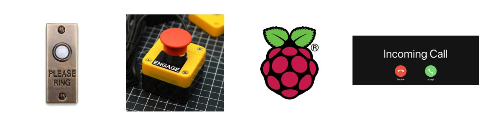

# DINGDONG

I don't always hear the doorbell but Alexis does.
So I did the reasonable thing: 
 
created a jets / lambda webserver that calls me, which is triggered by a very large button hooked up to a raspberry pi, which Alexis then pushes when the actual doorbell rings.  
 

 
mostly I'm just procratinating. I really need to study.
 
 
 
Basics:  
https://www.twilio.com/blog/serverless-ruby-on-aws-lambda-with-the-jets-framework  
https://www.twilio.com/docs/voice/quickstart/ruby  

Secrets:  
https://rubyonjets.com/docs/env-files/  


## Webserver 
 
```
jets new doorbell --mode api --no-database
jets generate controller Dingdong create
```
patch the routes file 
 
create & use an aws user with irresponsible permissions 
```
{
    "Version": "2012-10-17",
    "Statement": [
        {
            "Effect": "Allow",
            "Action": [
                "apigateway:*",
                "cloudformation:*",
                "dynamodb:*",
                "events:*",
                "iam:*",
                "lambda:*",
                "logs:*",
                "route53:*",
                "s3:*",
                "ssm:*"
             ],
            "Resource": [
                "*"
            ]
        }
    ]
}
```
 
`jets deploy` 
 
 
 
## Absurd button
 
Program the button 
https://gist.github.com/bongardino/2a3f9aec5bae606a4cb4d42f9307e5a2 

## Configure the PI
edit `/etc/xdg/openbox/lxde-pi-rc.xml` - you're not supposed to but whatever we've already wandered far from "best practices" 

add this to the `<keyboard>` section
```
<!-- <keyboard> -->
  <keybind key="C-S-9">
    <action name="Execute"/>
  <command>bash -c "curl -SivkL --header "authorization: $auth_header" $api-endpoint/dev/dingdong</command>
    </action>
  </keybind>
<!-- </keyboard> -->
```
 
`openbox --restart && openbox-lxde-pi --restart` 
 
# PUSH ZEE BUTTON
